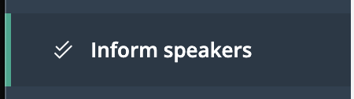
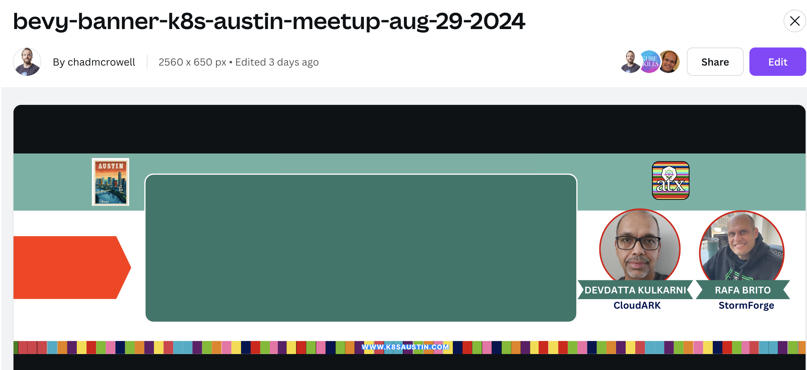
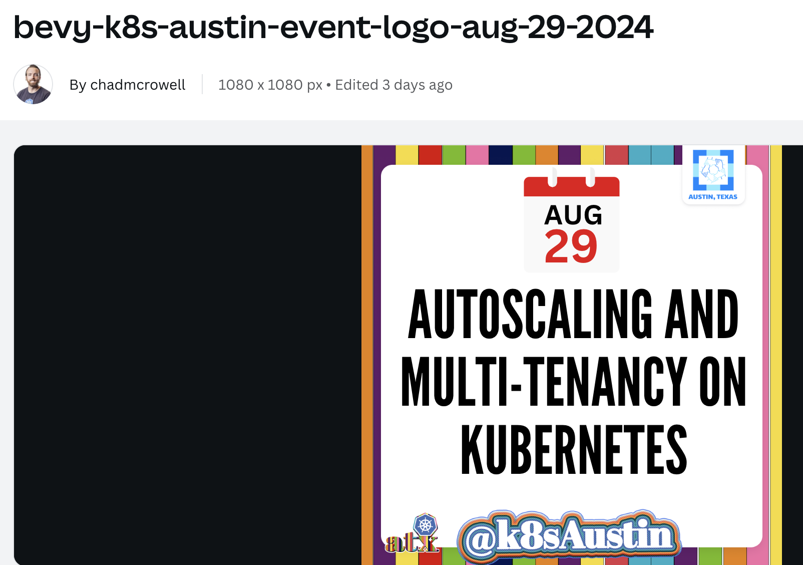
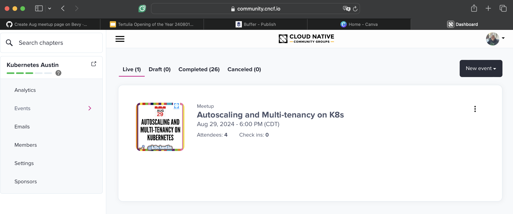
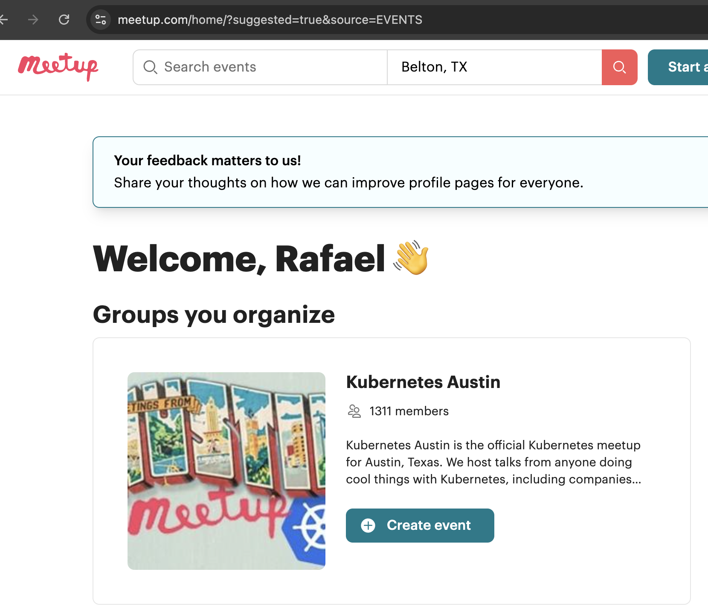

# How to Create an Event

This is the rough steps in how to create a meetup event from scratch.

## Sessionize: Secure the Speaker(s), Confirm Availability, and Officially Approve

- Insure speakers submit their talks and bios via [Sessionize](https://sessionize.com/app/organizer/event/13876).
    - For special cases, an organizer can volunteer to submit on the speakers' behalf.
- Coordinate with the speaker(s) the date and venue to confirm their availability in email, CC: mailto:organizers@k8saustin.com
- When confirmed, update the Sessionize talk status to Accepted and request they formalize their agreement in Sessionize.
    - This is important if speakers want a record of their talks (which counts towards commuinity contribution).

## Canva: Create Art

Create three pieces of art for the event:
1. An event banner for Bevy
1. An event logo for Bevy and Meetup (reuse for LinkedIn)

Login on [Canva](https://canva.com) and look for "KubeSkill" folder.

For #1, it is a `2560 x 650 px` banner, look for files named `bevy-banner-k8s-austin-meetup-<date>`, pick one and save as and edit the speakers' name, picture and companies.
*Leave the middle of the banner blank*.
Example

For #2, it is a `1080 x 1080 px` tile for the logo. Look for files named `bevy-k8s-austin-event-logo-<date>`.
Same drill, pick one, save as and edit it with the title and date. Some examples are titled: social-media-j8s-austin-event-MMM-DD-YYYY
Example:

## Create a Bevy Event

Log on [Bevy](https://community.cncf.io/accounts/dashboard/#/chapter-177/events-Live), make sure you have access to the Kubernetes Austin dashboard: 

It is easier to duplicate a previous event than to click at `New Event -> Meetup` and follow the prompts.
Copy and paste from the previous event, we always link the speaker's name to their LinkedIn profile.

If the event is being hosted at [Capital Factory](https://www.capitalfactory.com), please make sure their logo and address are displayed (for contractual reasons).
Desirably, if you have the name of the room, make sure it is displayed correctly and prominently.
Upload the event banner and thumbnail you made previously.
Add all the co-organizers as host. Add sponsors (whoever is paying for foods and drinks).
Use the option to RSVP, we usually limit capacity to 50 people.

## Create a K8sAustin.com/ShortURL

Once you have a URL for the event, go to `https://github.com/chadmcrowell/k8saustincom/blob/main/_redirects` and edit file or submit a pull request. Test it: https://K8sAustin.com/ShortURL-example

## Create a Meetup Event

Log on [Meetup](https://www.meetup.com/home/), view the dashboard (like below) and click at `Create Event`.
Use the "Copy the Last Event" button or copy and paste from a previous event.
Link to the Bevy event because of CNCF ownership; we hope to migrate off Meetup.
Make sure to add descriptive topics, such as: `kuberenetes, cloud native, open source`.

## Promote the Event!

[Via Buffer](posting-on-buffer.md).

Schedule (ideally three) two weeks before, one week before, a few days before the event!
Update descriptions (and graphics if you have the energy) with last minute changes or the confirmed room.
