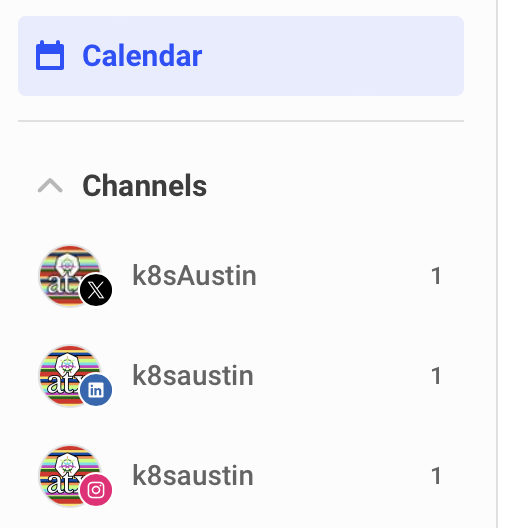

# Step-by-Step Posting Events

We use [Buffer](https://buffer.com) to manage posts across the three social media platforms: LinkedIn, Instagram and X.

## Login

We use a single login on Buffer, please make sure you get the login and password from the organizers.

## Main Page

Go to https://publish.buffer.com/profile/666739757839e9e8797abfab/tab/queue

See the calendar and make sure what it is flight. Then prepare to click on each channel.
See there are the three channels, one per platform. I prefer to schedule each post individually for each channel.

### LinkedIn

`Channels->LinkedIn->Sent`, one will see all previous post. If there is one already sent before and you can recycle it (ie using same link and picture), click at `Duplicate`.

Edit the new post and schedule the post. Make sure you confirm the spelling via the preview window (right part).

If it is the first post for the event, you will need the art and handlers of the speakers.

### Instagram

Same steps as before, but it only notifies to schedule the post.

### X

It has the limitation of characters, so be aware.

